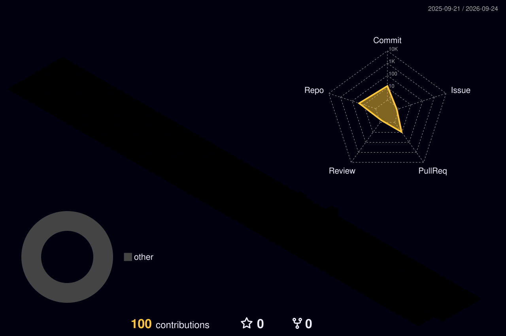

 

## 👨‍💻 About Me

<table>
<tr>
<td width="60%">

I am a **Full Stack Developer** focused on building clean, reliable and user-friendly software.

I enjoy turning complex business logic into clear, maintainable systems.  
For me, code is not only about implementing features, but also about solving real problems, improving product experience and creating long-term value.

- 🔭 Focus on **Backend Architecture** and **Frontend Engineering**
- 🌱 Currently learning **Distributed Systems**, **System Design** and **AI Application Integration**
- 💬 Ask me about **Java, Spring Boot, Vue, Redis, MySQL**
- ⚡ Motto: **Build clean, reliable and useful software**

</td>
<td width="40%">

</td>
</tr>
</table>

---

## 🛠️ Tech Stack

### Backend

### Frontend

### Tools

---

## 📊 GitHub Overview

  

  

---

## 🔥 GitHub Stats

---

## 📈 Activity Graph

---

## 🌌 3D Contribution Heatmap

---

## 🧩 Featured Projects

<table>
<tr>
<td width="50%">

### 🌐 XiaoQi Blog

A personal blog system focused on content presentation, user experience and backend performance.

**Tech Stack:**  
Java / Spring Boot / Vue / Redis / MySQL

<a href="https://github.com/JackWenStack">View Project →</a>

</td>
<td width="50%">

### ⚙️ Admin Management System

A business-oriented admin system with data tables, advanced filters, review workflows and permission control.

**Tech Stack:**  
Vue / Vben Admin / VXE Table / Spring Boot

<a href="https://github.com/JackWenStack">View Project →</a>

</td>
</tr>
</table>

---

## 🐍 Contribution Snake

<picture>
  <source media="(prefers-color-scheme: dark)" srcset="https://raw.githubusercontent.com/JackWenStack/JackWenStack/output/github-contribution-grid-snake-dark.svg">
  <source media="(prefers-color-scheme: light)" srcset="https://raw.githubusercontent.com/JackWenStack/JackWenStack/output/github-contribution-grid-snake.svg">
  
</picture>

---

## 📫 Contact Me

 

